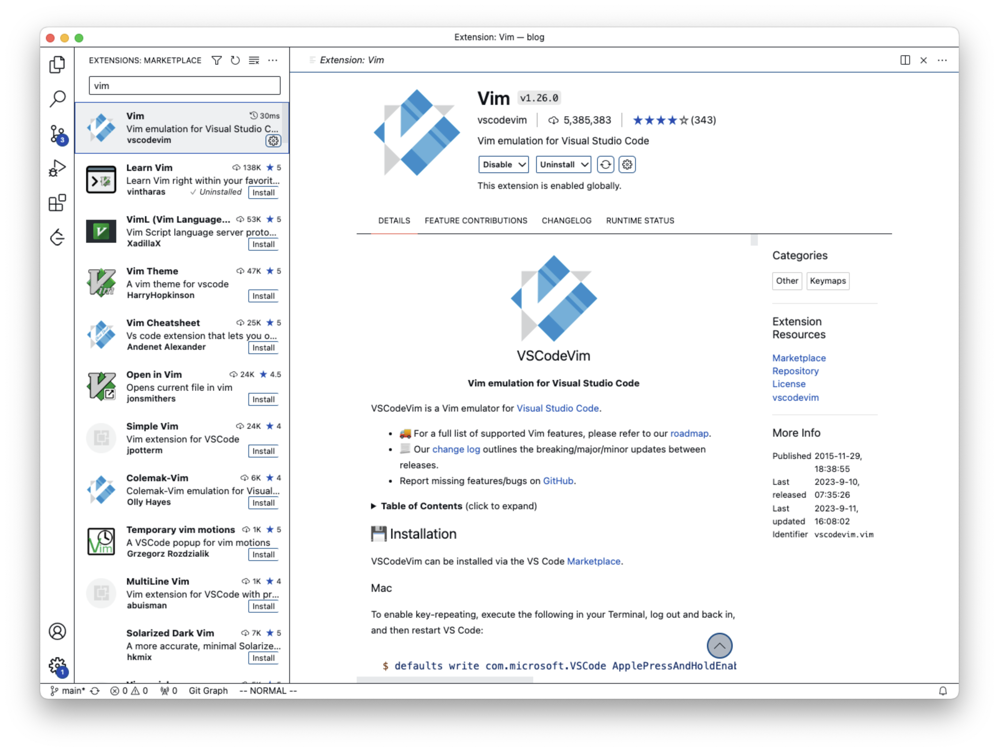

# 介绍

简单来说，程序就是一串串的字符，而编程就是对这些字符进行增删改查。在这个过程中，我们通常使用键盘进行字符的输入，而输入的字符会出现在当前光标的后面，如果我们要移动光标，那么通常会使用鼠标(触控板)或是方向键，这是符合常理的。

但我十分讨厌这个流程，因为在编码时，无论是使用鼠标(触控板)，还是方向键(大都位于键盘的右下角)，都会迫使我的一只手离开键盘的区域，而移动完光标后，需要重新回到键盘的区域，这样效率十分低下，并且非常影响编码的流畅性。

而 Vim 提供了一种完全不同的编码方式，它让我们可以直接使用键盘移动光标到任意位置，并且这个过程十分迅速，精准，这是我使用 Vim 最大的原因，它大大降低了对鼠标(触控板)的依赖。

当然，这只是 Vim 的冰山一角。

## 安装

想要在 VSCode 中使用 Vim，首先需要安装 Vim。



接着，根据文档中 Installation 部分的内容对电脑进行配置(Mac)。

```
$ defaults write com.microsoft.VSCode ApplePressAndHoldEnabled -bool false              # For VS Code
$ defaults write com.microsoft.VSCodeInsiders ApplePressAndHoldEnabled -bool false      # For VS Code Insider
$ defaults write com.vscodium ApplePressAndHoldEnabled -bool false                      # For VS Codium
$ defaults write com.microsoft.VSCodeExploration ApplePressAndHoldEnabled -bool false   # For VS Codium Exploration users
```

打开一个文件，我们会发现光标由原来的一条线变为了一个方形，并且在下方状态栏的左边出现了 `NORMAL` 的标志，这就说明我们安装成功了。
